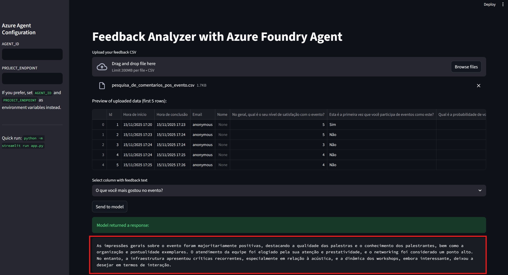

# 📝 README.md — Feedback Analyzer com Azure AI Foundry
## 📌 Visão Geral do Projeto

Este projeto implementa um Agente de Análise de Feedback utilizando os recursos do Azure AI Foundry, combinado com uma interface amigável construída em Streamlit.

O objetivo principal é permitir que usuários analisem rapidamente todos os comentários de formulários, especialmente de **Microsoft Forms exportados em CSV**. Porém, o sistema funciona com qualquer arquivo CSV que contenha uma coluna de respostas textuais abertas.

Basta selecionar a coluna desejada na interface, e o agente realizará a análise automática, incluindo:

- Resumo geral das impressões dos participantes
- Identificação dos pontos mais citados
- Sinais de sentimento (positivo, negativo, misto)
- Principais elogios e críticas
- Observações relevantes destacadas pelo modelo

O agente foi configurado no Azure Foundry com prompts e instruções específicas, garantindo que toda a análise seja estruturada, clara e acionável. Exemplo de uso:




---

## 🎯 Objetivo do Agente


O FeedbackAgent, criado no Azure Foundry, tem o propósito de:

- Receber uma lista de feedbacks textuais (em massa).
- Analisar o conteúdo, extraindo temas comuns.
- Identificar sentimentos predominante.
- Sumarizar os principais pontos positivos e negativos.
- Gerar um texto final consolidado com a visão geral do evento/atividade.

**Instrução usada no agente:**

“Resuma as impressões gerais dos comentários em um parágrafo conciso, destacando os pontos positivos, os elogios comuns e as críticas recorrentes. Se houver pontos negativos significativos, mencione-os objetivamente.”

---

## 🚀 Executando o Projeto Localmente

**1. Clone o repositório**

````
git clone https://github.com/<seu-usuario>/<seu-repo>.git
cd <seu-repo>
````

**2. Instale as dependências**

````
pip install -r requirements.txt
````

**3. Configure credenciais do Azure Foundry**

> ⚠️ Para usar o projeto, é necessário possuir um ID de agente (AGENT_ID) e um endpoint de projeto (PROJECT_ENDPOINT) válidos, vinculados à sua própria conta Azure com créditos ou permissão para uso do Azure AI Foundry.

Primeiro autentique sua conta Azure no terminal com:
```
az login
```

<u>✔ Método A — Variáveis de ambiente (recomendado)</u>
Crie um arquivo .env na raiz:

```
AGENT_ID=asst_xxx...
PROJECT_ENDPOINT=https://<seu-projeto>.services.ai.azure.com
```

A autenticação garante que o SDK do Azure consiga acessar os recursos do seu agente no Foundry. Para mais detalhes, clique [aqui](docs/Passo%20a%20Passo.pdf).

<u>✔ Método B — Preenchendo no próprio Streamlit (sidebar)</u>
Basta preenhcer os campos:

- AGENT_ID
- PROJECT_ENDPOINT

diretamente no menu lateral da interface. Se o Método A estiver configurado, não é necessário preencher novamente na interface.

**4. Execute a aplicação Streamlit**
````
streamlit run app.py
````
---

## 🔐 Segurança

- API key, senhas e outras URLs não devem estar visíveis no repositório. Podem ser definidas em ".env".
- .env deve estar listado no .gitignore.
- Uso de  DefaultAzureCredential sempre que possível para evitar chaves expostas.

---

## 📚 Referências e Links

[SDKs do Azure para Python](https://azure.github.io/azure-sdk/releases/latest/python.html): Documentação dos SDKs utilizados para autenticação e integração com serviços Azure, inclusive o pacote _azure-ai-agents_.

[Instalação da CLI do Azure no Linux](https://learn.microsoft.com/pt-br/cli/azure/install-azure-cli-linux?view=azure-cli-latest&pivots=apt): Guia oficial para instalação do Azure CLI, ferramenta usada para autenticação local.

[Autenticação Local com Azure CLI para Python](https://learn.microsoft.com/pt-br/azure/developer/python/sdk/authentication/local-development-dev-accounts?tabs=azure-cli%2Csign-in-azure-cli): Explica como usar o comando _az login_ e como a autenticação é utilizada pelos SDKs Python.

[Threads, Runs e Messages em Agents](https://learn.microsoft.com/en-us/azure/ai-foundry/agents/concepts/threads-runs-messages): Explica o funcionamento do ciclo de execução de agentes no Foundry e a lógica de mensagens usadas pelo backend.

[Verificação de Regiões dos Modelos](https://learn.microsoft.com/en-us/azure/ai-foundry/agents/concepts/model-region-support?tabs=global-standard): Neste link está explicado quais modelos do Azure Foundry estão disponíveis para uso em quais regiões e limitações de deploy.

[Azure Foundry (AI Studio)](https://learn.microsoft.com/pt-br/azure/ai-foundry): Documentação oficial sobre o ambiente de criação, orquestração e deploy de projetos de IA usando Azure Foundry.

[Streamlit](https://streamlit.io): Documentação da ferramenta utilizada para a interface web local.

---

## 🔁 Reprodutibilidade

Um **passo a passo** detalhado e ilustrado, cobrindo desde a criação do agente até o uso da interface local, incluindo detalhes de implementação, possíveis expansões e limitações do Azure, está disponível no PDF:

👉 [Docs/Passo a Passo.pdf](docs/Passo%20a%20Passo.pdf)

Consulte esse material para reproduzir todo o processo, tirar dúvidas ou expandir o projeto para outros casos de uso.